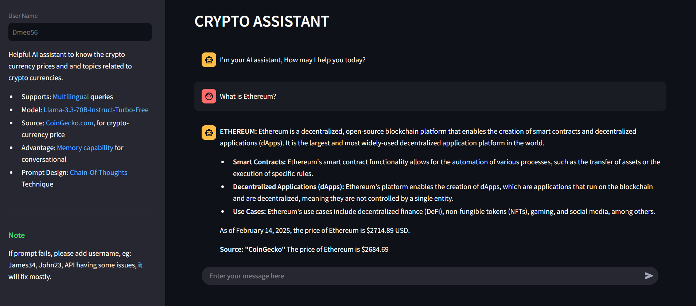

## AI Agent for Cryptocurrency Insights

## Overview
This project is an AI-powered assistant that provides insights about cryptocurrency. It uses external APIs to fetch crypto-currency prices and leverages the Together.ai platform to run a LLaMA model for generating responses. The application does not rely on any specific frameworks and uses prompt engineering techniques to structure the AI's responses effectively.

---

## Table of Contents

- [Prerequisites](#prerequisites)
- [Installation](#installation)
  - [Step 1: Setting up the Virtual Environment](#step-1-setting-up-the-virtual-environment)
  - [Step 2: Installing Dependencies](#step-2-installing-dependencies)
- [Running the Application](#running-the-application)
  - [Step 3: Starting the Backend](#step-3-starting-the-backend)
  - [Step 4: Starting the Frontend](#step-4-starting-the-frontend)
- [Accessing the Application](#accessing-the-application)
- [Conclusion](#conclusion)

---

## Prerequisites
Before starting the application, make sure that you have the following installed:
- **Python 3.12**: This project is compatible with Python 3.12 and above.
- **pip**: Python's package installer to install dependencies.
- **Streamlit**: A Python-based framework for building web apps (needed to run the frontend).

Additionally, you will need:
- **API Keys** for accessing external cryptocurrency data (e.g., CoinGecko).
- **Together.ai API Key** for running the LLaMA model.

---

## Installation

### Step 1: Setting up the Virtual Environment
To ensure your project has isolated dependencies, set up a virtual environment inside the project directory.

1. **Navigate to the project folder**:
   ```bash
   cd siemens_assignment

2. Create the virtual environment by running the following command:
    ```bash
    python -m venv .venv

    This will create a .venv folder in the siemens_assignment directory.
   
3. Activate the virtual environment:
    ```bash
    For Windows:
    .venv\Scripts\activate
    
    For macOS/Linux:
    source .venv/bin/activate
   
### Step 2: Installing Dependencies
Once your virtual environment is active, refer (AI Agent Documentation) docx attached in mail. you need to install all required dependencies for the project.

1. Ensure you're in the project directory (siemens_assignment), where the requirements.txt file is located.
2. Install the dependencies using pip:
    ```bash
   pip install -r requirements.txt
   
This will install all the necessary libraries, including requests, fastapi, streamlit, and others that your project needs to run.

---

## Running the Application
### Step 3: Starting the Backend 
The backend is built using FastAPI, which handles the conversation logic and communicates with external APIs to fetch cryptocurrency information.
1. Navigate to the src folder in your project directory:
    ```bash
   cd src
   
2. Start the backend server by using uvicorn. This will launch the FastAPI server on your local machine:
  ```bash
    uvicorn backend:app --host 0.0.0.0 --port 8080 --reload
```

   
3. The FastAPI server will run at http://127.0.0.1:8080. It exposes the /conversation endpoint to handle user queries.
    ```bash
   cd ..
   siemens_assignmnet
  
   
4. Now start the frontend UI through app.py using cmd 
    ```bash
   streamlit run app.py
   ```
    
---

## Accessing the Application
Once both the backend and frontend are running, you can interact with the AI agent through the Streamlit UI. Here’s how the flow works:

- The frontend (Streamlit) sends user messages to the backend (FastAPI).
- The backend processes the request, interacts with external APIs for cryptocurrency data, and generates a response using the LLaMA model.
- The response is sent back to the frontend, where it’s displayed in the chat interface.

---

## Conclusion
This project provides a simple yet powerful AI assistant that leverages real-time cryptocurrency data and the LLaMA model to provide intelligent responses. With the instructions above, you should be able to set up and run the application seamlessly.

---
